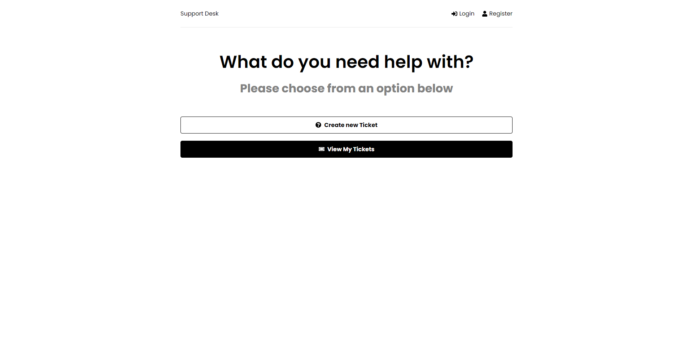
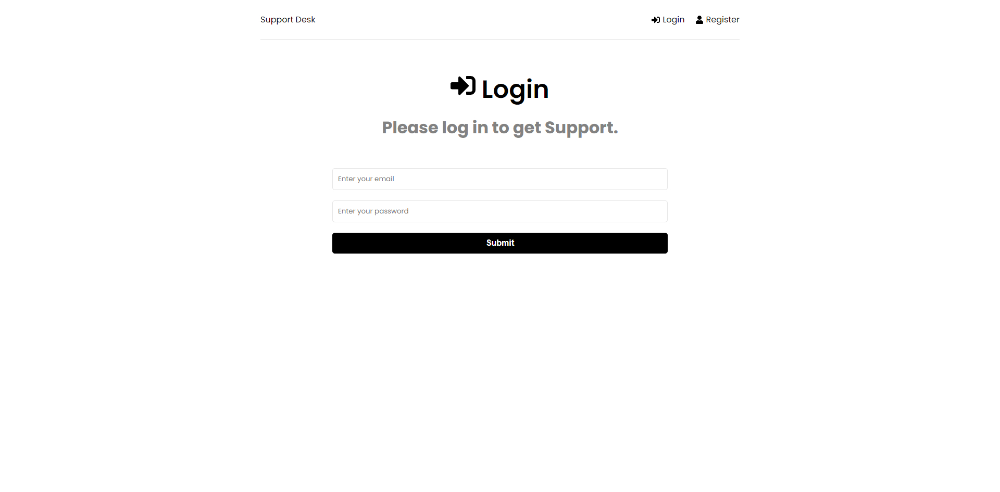
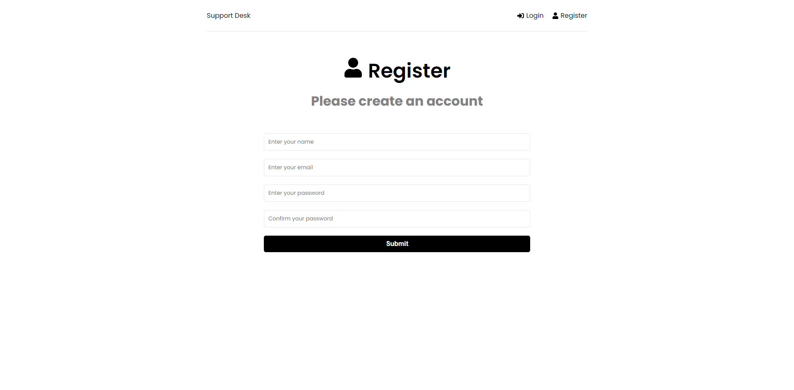
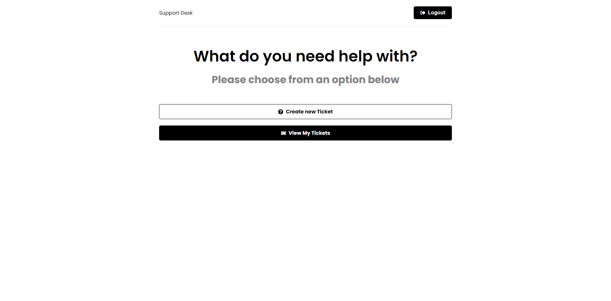
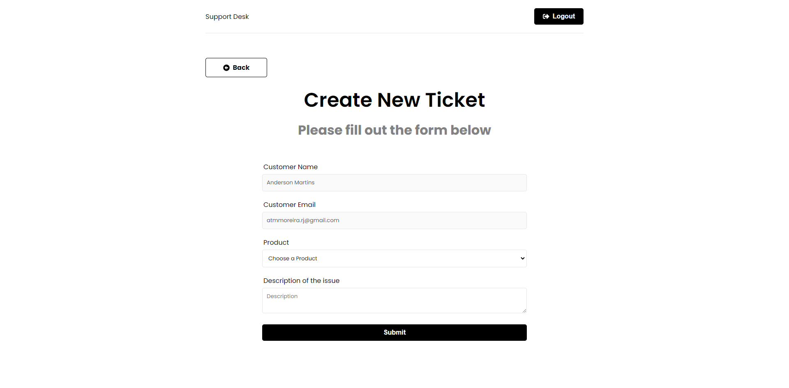
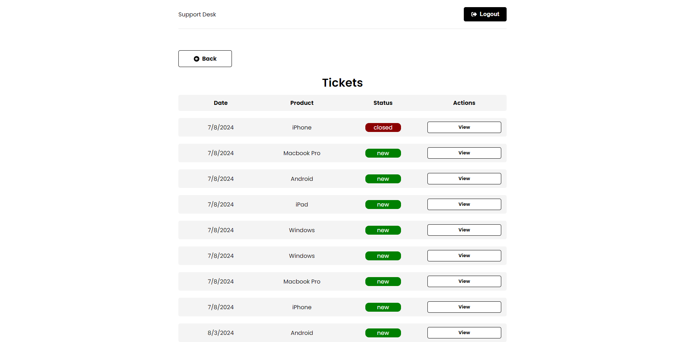
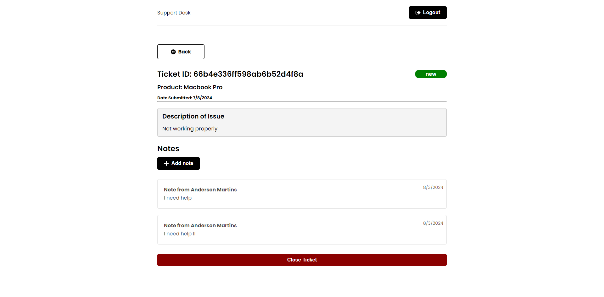

<div align="center">
  
  <h1>Anderson Toledo Martins Moreira</h1>
  <h4>
    <a href="http://www.atmm.dev" target="_blank">Resume Online</a>
  </h4>
</div>
<br >
<!-- References for Create budgets :: https://shields.io/category/build -->
<div align="center">
  
  
  
  
  
  
  
</div>

<br >

## Description
This is a project to support teams creating tickets for tasks with Vite, Node, Express, Axios, React, React Toastify, Redux Toolkit, React Router, JWT, MongoDB and Mongoose. Click <a href="https://project-github-finder-react-vite.vercel.app/"> here </a> to see the project.

## Screens Layout
<div align="center">
<br /> Home Page
  
<br /> Login Page
  
<br /> Register Page
  
<br /> Tickets View Page
  
<br /> Create Tickets Page
  
<br /> View Tickets Page
  
<br /> View Ticket Page
  
</div>

<br >

## Programming Languages and Frameworks.
```bash
# HTML5 / CSS3
# Javascript
# React.js 18.2.0
# React Router 9.1
# React Redux-Toolkit 2.2.5
# React Modal 3.16
# React Toastify 10.0
# React Icons 5.2
# Axios
# Vite 5.2
# Git / Github
# Node.js
# Express.js 4.19
# MongoDB 6.7
# Mongoose 8.4
```

<br >

## System Requirements
```bash
# Git
# Node
# Vite
```

<br >

## Getting Started With Local Development Configuration

```bash
# Download or clone the repository.
# Open the project inside your favorite IDE (I use VSCode).
# To install dependencies of this project, type in the terminal: 'npm install' or 'npm i'.
# To run this project, type in the terminal on root folder: 'npm run dev'. This command will start the Frontend and Backend API.
# In your favorite Browser, open this URL:  http://localhost:5173/ to see the Interface.
# In your favorite Browser, open this URL:  http://localhost:5000/ to see the API.
```
